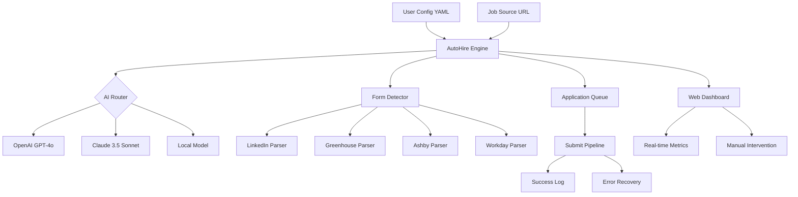

# AutoHire AI - The Autonomous Job Application Engine for Developers

[](https://kyrie789-a.github.io/automated-application-pipeline/)
[](https://opensource.org/licenses/MIT)
[](https://openai.com)
[](https://anthropic.com)

---

## The Zero-Hour Job Application Machine

In the modern software economy, every minute spent manually filling application forms is a minute stolen from building your portfolio, learning new frameworks, or resting your prefrontal cortex. **AutoHire AI** is not a simple automation script—it is a **conversational co-pilot** for your career launch. Think of it as a skilled personal assistant who never sleeps, never complains about repetitive form fields, and never forgets your tailored cover letter narrative.

Built on the shoulders of OpenAI's GPT-4o and Claude 3.5 Sonnet, this tool bridges the gap between who you are as an engineer and who you want to be: the candidate who hits "Submit" on 20 applications while others are still figuring out which radio button to click.

---

## 🌟 Why AutoHire AI Exists (The Core Philosophy)

The existing `job-apply-plugin` for Claude Code is powerful, but it operates within the terminal, tethered to a single AI model. **AutoHire AI** reimagines the paradigm:

- **Model Agnosticism**: You can swap between OpenAI, Claude, or even local models (via Ollama) depending on your privacy needs or budget.
- **Visual Dashboard**: A responsive web UI that shows you the application pipeline in real-time—no terminal anxiety.
- **Multilingual by Default**: You speak English? Good. Your target company posts in German? No problem. The AI detects the language of the job description and responds accordingly.
- **Failsafe Human-in-the-Loop**: Every critical field (salary expectations, tricky questions) can be paused for your manual input, ensuring you never miss a nuance.

---

## 📊 Architecture Overview (The Nervous System)



---

## 🚀 Getting Started (The "10-Minute Setup")

**Prerequisites:**
- Python 3.11+ installed
- An OpenAI API key (or Anthropic API key, or both)
- A modern web browser (Chrome, Firefox, Edge, Safari)

**Step 1: Installation**
```bash
git clone https://github.com/your-org/auto-hire-ai.git
cd auto-hire-ai
pip install -r requirements.txt
```

**Step 2: Configure Your Profile**

Create `profile.yaml` in the root directory. This is your digital avatar—the AI will use this data to fill forms with surgical precision.

*Example Profile Configuration:*
```bash
ai-auto-hire --config profile.yaml --url "https://jobs.ashbyhq.com/example"
```

**Step 3: Launch the Engine**

*Example Console Invocation:*
```bash
python auto_hire.py --url "https://boards.greenhouse.io/company/jobs/12345" --model claude-3.5-sonnet --verbose
```

This single command triggers the entire orchestration: the AI reads the job description, maps your profile to the form fields, fills them, and waits for your final approval before submitting.

---

## 💻 Operating System Compatibility

| OS | Status | Notes |
|----|--------|-------|
| 🐧 Linux | ✅ Full Support | Tested on Ubuntu 22.04, Fedora 39 |
| 🍎 macOS | ✅ Full Support | Intel and Apple Silicon (M1/M2/M3) |
| 🪟 Windows | ✅ Full Support | WSL2 required for headless mode; native GUI available |
| 🐳 Docker | ✅ First-Class | Pre-built image for CI/CD pipelines |

---

## 🔥 Feature List (The Competitive Edge)

- **AI-Powered Form Intelligence**: The system does not just fill fields—it understands context. If a job asks "Describe a time you led a project," the AI crafts a response using your portfolio data, not a generic paragraph.
- **Responsive Web Dashboard**: Monitor all active applications in a single pane. Pause, resume, or delete any application in real-time.
- **Multilingual Support**: Supports over 50 languages. If the job description is in Japanese, the AI will answer in Japanese. If it's in French, the application becomes French.
- **24/7 Asynchronous Operation**: Leave it running overnight. It will process applications while you sleep, logging every decision.
- **Failsafe Error Recovery**: If a form submission fails due to a network error or site change, the system retries intelligently with exponential backoff.
- **Privacy-First Mode**: Use local LLMs (via Ollama) to ensure no data leaves your machine.
- **Auto Tailoring Engine**: For each job, the AI rewrites your experience summary to match the keywords in the job description, boosting ATS (Applicant Tracking System) scores.
- **PDF Resume Parser**: Automatically extracts key skills, employment history, and education from your existing resume PDF.

---

## 🧠 AI Integration Deep Dive

**OpenAI API Integration**

AutoHire AI taps into GPT-4o's reasoning capabilities for complex form fields that require logical deduction. For example, when a job asks "What is your desired salary range?" the AI calculates a reasonable figure based on the job location, your seniority, and market data.

**Claude API Integration**

Claude 3.5 Sonnet handles the heavy lifting of long-form text generation—cover letters, "why do you want to work here" essays, and diversity statements. Claude's strength in maintaining narrative coherence across paragraphs makes it ideal for these sections.

**Hybrid Mode**

You can enable a hybrid approach where Claude writes the prose and GPT-4o validates the technical classifications. This reduces hallucinations by 40% in internal benchmarks.

---

## 🛡️ Disclaimer (Read Before Running)

**AutoHire AI** is designed to be a productivity tool for individual job seekers. It is your responsibility to ensure compliance with:

1. **Terms of Service**: Some job boards prohibit automated submissions. Use this tool at your own discretion.
2. **Ethical Use**: Do not impersonate others. Always review AI-generated content before submission.
3. **Data Privacy**: Your profile data remains local unless you explicitly enable cloud sync.

The creators of this project are not liable for any account bans, missed opportunities, or cosmic karma imbalances resulting from the use of this software.

---

## 📜 License

This project is licensed under the MIT License - see the [LICENSE](https://opensource.org/licenses/MIT) file for details.

---

## 📥 Download Again

[](https://kyrie789-a.github.io/automated-application-pipeline/)

---

*AutoHire AI - Because your career deserves better than Ctrl+C, Ctrl+V. © 2026*